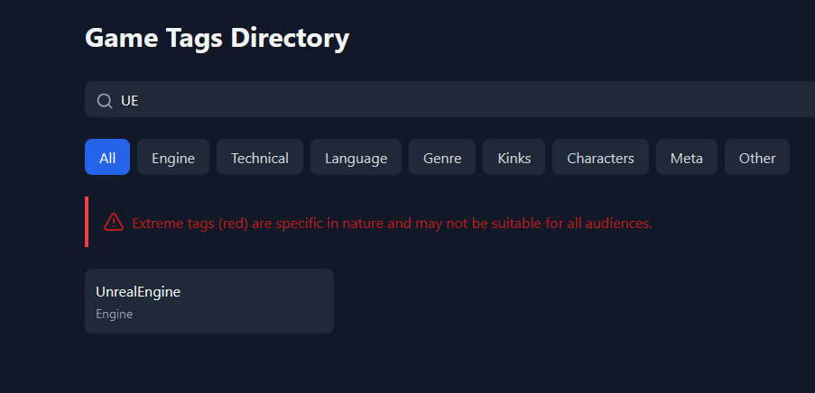
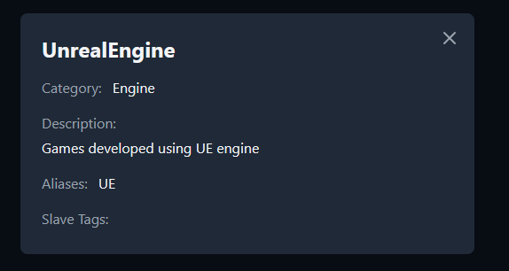

# Game Tags Directory for The Hidden Insanity Archive Reviews

This directory provides a standardized set of tags used in The Hidden Insanity Archive reviews. It allows for easy searching and browsing of videogames tags, their specific content.

## Getting Started

Simply open `index.html` in your web browser to start using the Game Tags Directory.

## Searching for Tags

You can easily search for tags using the search bar.  Just type in the tag you're looking for and the directory will filter the results.

You can also search using tag aliases.  This is useful if you're unsure of the exact tag name.

Aliases inside Tag Modal Screen

## Viewing Tag Details

Clicking on a tag button will open a modal window displaying full details about the tag, including its description, aliases, and related tags.

